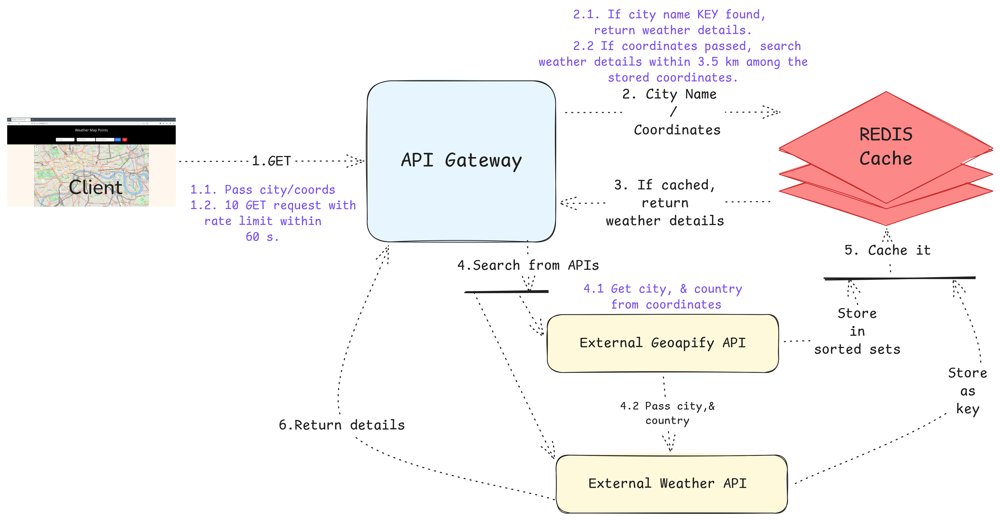
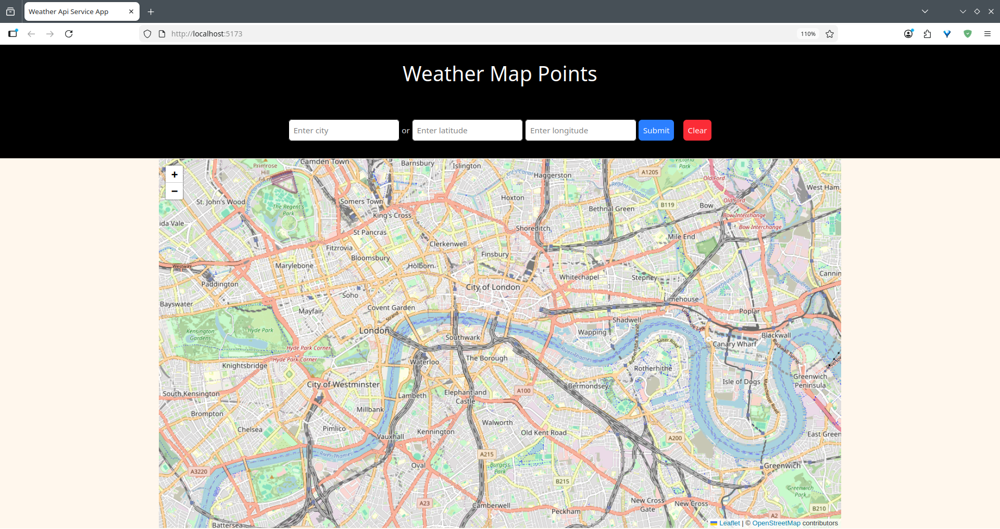
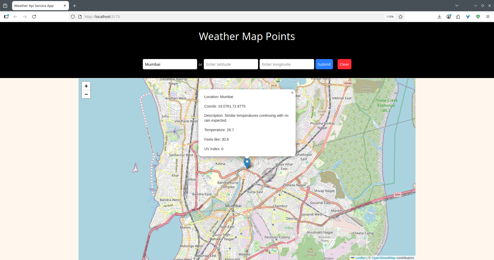
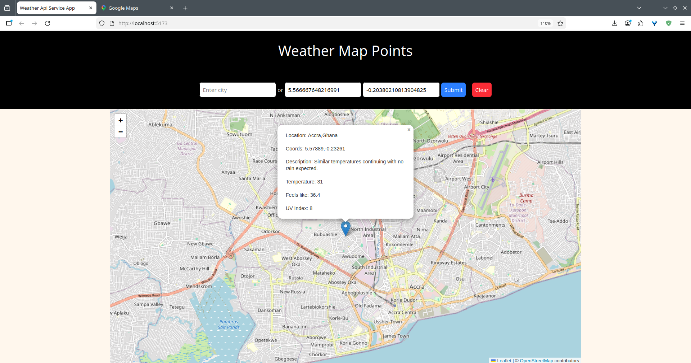

# 🌤️ Weather API Service

We have built a weather API service that fetches weather details from third-party APIs. We've used Rust with *Axum* framework to manage our backend app, and the frontend is purely written in HTML, and JavaScript. For styling, we've used external CSS library named tailwindCSS.

---
## Features

* Weather details are fetched by passing either a city name or coordinates. The fetched results are pinpointed on a map on the frontend, with a pop-up displaying a few weather details, such as description, temperature, and UV index, etc. 

* External APIs:
    * [Weather API](https://www.visualcrossing.com/) - It is a comprehensive weather data service providing historical, real-time, and forecast weather data through a user-friendly API, Data Downloader, and analytical tools.
    * [Geoapify API](https://www.geoapify.com/) - A location platform providing APIs and map services for developers to build location-aware apps, such as mapping, geocoding, address autocomplete, and route planning.

* For our weather service API, we have implemented a custom *rate-limit* algorithm, where all the users can make a request in a span of 60 seconds.

--- 

## High-level Design

<p style="text-align: center;">

    <em>Fig. 1 HLD of Weather API Service</em>
</p>

---

## API Endpoints

### Public Routes
| Method | Endpoint | Description |
|--------|----------|-------------|
| `GET`  | `/health` | Health check |
| `GET` | `/v1/weather` | Get weather details |

---

## Getting started

#### Prerequisites
- [Rust](https://www.rust-lang.org/tools/install)
- [Cargo](https://doc.rust-lang.org/cargo/)
- [npm](https://www.npmjs.com/)
- [docker](https://www.docker.com/)
- [Weather API Key](https://www.visualcrossing.com/)
- [Geoapify API Key](https://www.geoapify.com/) 

#### Setup Docker
```bash
# 1. Pull docker images
$ docker pull redis

# 2. Run docker redis instance
$ docker run --name my-redis -p 6379:6379 -d redis
```
#### Clone Repo
```bash
# 1. Clone Repo
$ git clone https://github.com/abhilashmendhe/backend_projects

# 2. Go to _3_weather_api_service 
$ cd _3_weather_api_service
```

#### Setup .env file
```bash
# 1. Open .env
$ vim .env

# 2. Edit .evn
HOST=127.0.0.1
PORT=3000
RATE_LIMIT_SIZE=10
LOCATION_RADIUS=5
VISUAL_CROSSING_KEY="API KEY"
GEOAPIFY_KEY="API KEY"
~                                                
~                                                
~                                            
~    
# 3. Save and exit
```

#### Backend Setup
```bash
# 1. Start backend server
$ cargo run 
```

#### Frontend Setup
```bash
# 1. Go to _3_weather_api_service/frontend
$ cd ./_3_weather_api_service/frontend

# 2. Intall npm packages
$ npm install .

# 3. Start frontend
$ npm run dev
  VITE v7.1.3  ready in 702 ms

  ➜  Local:   http://localhost:5173/
  ➜  Network: use --host to expose
  ➜  press h + enter to show help
```
---

# Frontend Visualization

1.  Open frontend URL http://localhost:5173/ in any browser.

<p style="text-align: center;">

    <em>Fig. 2. Frontend Layout</em>
</p>

2. Enter any city name which will produce the following output.

<p style="text-align: center;">

    <em>Fig. 3. Weather details fetched by city name.</em>
</p>

2. Enter any valid coordinates which will produce the following output.

<p style="text-align: center;">

    <em>Fig. 4. Weather details fetched by coordinates</em>
</p>

---

# License

MIT License © 2025 Abhilash Mendhe