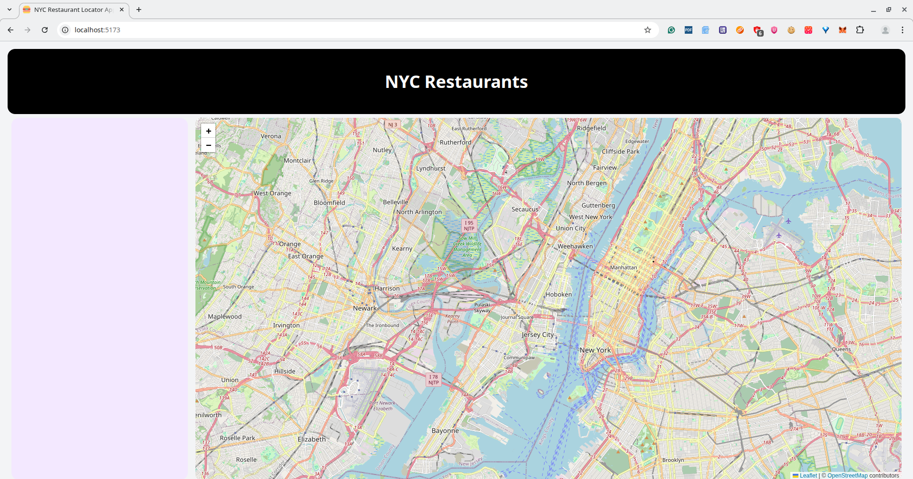
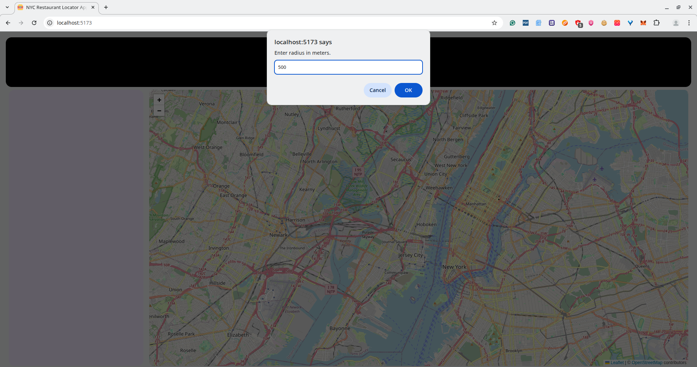
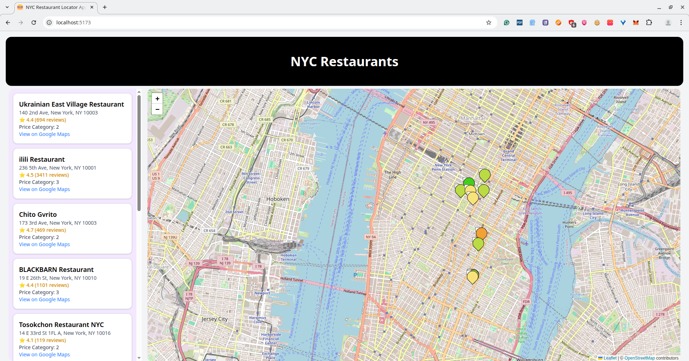

# 🍔 Restaurant Locator

This is a mini project focused on building a frontend application that allows users to interact with a map. Users can click on a location and specify a radius to retrieve nearby points of interest within New York. The primary goal of this project is to explore and understand the geospatial capabilities of PostGIS, an extension of PostgreSQL for handling geographic data. The backend is implemented in Rust using the Axum framework, providing API endpoints for geospatial queries.

### Data Engineering & Geospatial Processing

* Ingested a real-world NYC restaurant dataset and transformed it into geospatial data compatible with PostGIS.

* Designed a schema to store location data using geometry/geography types.

---
## Features

* 🗺️ Interactive Map

    * Users can click anywhere on the map to select a location.

* 📍 Radius-based Search

    * Specify a radius to fetch nearby locations within the selected area.

---
## API Endpoints

| Method | Endpoint | Description |
|--------|----------|-------------|
| `GET`  | `/v1/restaurants` | Fetches restaurants and their details |

---
## Getting started

#### Prerequisites
- [Rust](https://www.rust-lang.org/tools/install)
- [Cargo](https://doc.rust-lang.org/cargo/)
- [Python](https://www.python.org/)
- [Docker](https://www.docker.com/)

#### Docker Commands
```bash
# 1. To start docker
$ docker compose up

# 2. To stop docker
$ docker compose down -v 
```

#### Clone Repo
```bash
# 1. Clone Repo
$ git clone https://github.com/abhilashmendhe/backend_projects

# 2. Go to _4_nyc_restaurant_locator 
$ cd _4_nyc_restaurant_locator
```

#### Backend Setup
```bash
# 1. Start backend server
$ cargo run 
```

#### Frontend Setup
```bash
# 1. Go to _4_nyc_restaurant_locator/frontend
$ cd ./_4_nyc_restaurant_locator/frontend

# 2. Intall npm packages
$ npm install .

# 3. Start frontend
$ npm run dev
  VITE v7.1.3  ready in 702 ms

  ➜  Local:   http://localhost:5173/
  ➜  Network: use --host to expose
  ➜  press h + enter to show help
```
---

# Frontend Visualization

1.  Open frontend URL http://localhost:5173/ in any browser.

<p style="text-align: center;">

    <em>Fig. 2. Frontend Layout</em>
</p>

2. Click anywhere on the New York map. Do not click anywhere else or any city or/and country.

<p style="text-align: center;">

    <em>Fig. 3. Enter radius in meters.</em>
</p>

2. Fetched restaurants details pinpointed on map. Moreover, additional restaurant details are found on the left hand side of the UI.

<p style="text-align: center;">

    <em>Fig. 4. Restaurants in NY</em>
</p>

---

# License

MIT License © 2025 Abhilash Mendhe

