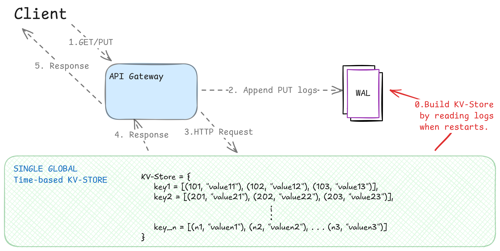

# ⏲️ Timebased KV-Store

This is a basic time-based key-value store that stores multiple values for the same key but for different timestamps that is monotonically increasing. This project is build on `Rust` and `Python`.

---

##  Features

The KV-store can support/store multiple `values` for a specific `key` based on the `timestamp`.

* **PUT**
    * Insert a `value` with the latest `timestamp` for a specific `key`.
    * Can insert another value with latest `timestamp` for the same `key`.

* **GET**
    * Fetch a `value` by sending `key` and a `timestamp`.
    * If `value` exists for the current `timestamp`, it returns the `value`.
    * If there are multiple such `values`, returns the value with the largest `timestamp`.
    * If no value exists for the timestamp _or_ key exists, returns `""`.

---

## High-level Design

<p style="text-align: center;">

    <em>Fig. 1 HLD of Timebased KV Store</em>
</p>

---

## Getting started

---  

## Example Requests (with `curl`)

```bash

# PUT Request - Insert a KV with timestamp
$ curl -X PUT http://localhost:8080 
    -H 'Content-Type: application/json' 
    -d '{
       "key": "mykey", 
       "value": "myvalue", 
       "timestamp" : 1673524092123456
     }'

# GET Request - Get a value for a specific timestamp
$ curl -X GET http://localhost:8080
    -H 'Content-Type: application/json' 
    -d '{
       "key": "mykey", 
       "timestamp" : 1673524092123456
     }'
```

---  

## Future Work

- [ ] Make high availability.
    - Implement consistent hashing.

---

## License
MIT License © 2025 Abhilash Mendhe
